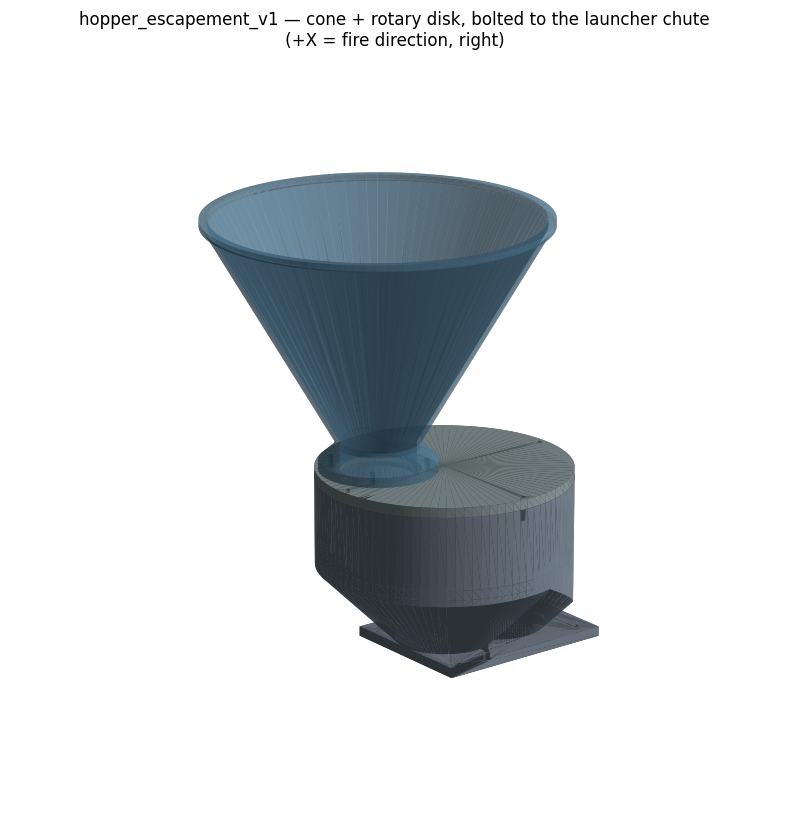
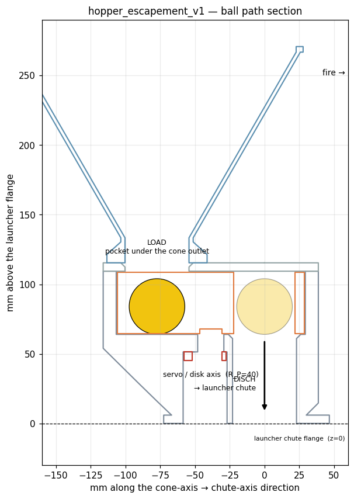

# hopper_escapement_v1 — cone hopper with the escapement disk built in

**2026-07-12.** Replaces the side-standing scoop-arm feed. One tower bolts straight
onto the launcher's drop-chute flange: cone → rotary disk → chute. No swinging arm,
no catch funnel, no telescoping coupler, no free-flight ball between subassemblies.




## What this kills

| Obsolete | Why |
|---|---|
| `feed_unit_v1` | the side-standing unit with the long scoop arm |
| `feed_servo_wall_v2` | its servo wall |
| `scoop_arm_cup26_v3` | the arm itself |
| `feed_launcher_coupler_v1` | upper tube + lower sleeve + catch funnel — all of it |
| `hopper_neckdown_v1` | superseded by the cone in this folder |

The `auger_lift_v2` recycle loop **stays** — it now just dumps over the cone's rim
instead of into the old feed unit. Its discharge must clear **271 mm above the
launcher chute flange** (≈ 427 mm above the bracket's bottom plate). Check that
against the current auger stack height before you commit.

## Mechanism

A Ø136 × 44 disk with **one Ø44 through-pocket** rides on a flat floor plate:

- **LOAD** — the pocket sits under the cone's Ø46 outlet. A ball drops in and rests
  on the *floor* (the pocket is a through-hole carrier, not a cup).
- **Sweep 150°** — everywhere else the floor blocks the ball below and the lid blocks
  the stack above. The drum wall is the disk's journal (0.75 mm clearance).
- **DISCH** — the pocket lands over the Ø46 floor hole, dead on the launcher's chute
  axis. Ball drops straight down the chute onto the quarter-pipe slide.

One MG996R on **ch5 (positional)** direct-drives the disk. Two commanded angles —
exactly the pattern `scripts/triwheel_spin_test.py` already runs:

```python
LOAD_ANGLE:  Final[float] = 15.0    # was 70.0  (v3 ring arm)
DISCH_ANGLE: Final[float] = 165.0   # was 175.0
```

150° of sweep instead of a full 180° so we're not gambling on a clone's end-of-range.
±5° of servo error still drops the ball — a Ø40 ball clears the Ø46-hole / Ø44-pocket
overlap up to ~5 mm of offset. Retune on the bench.

The 20 mm lateral (Y) offset of the cone axis is what buys that 150°, and it's free:
the tilt axis *is* Y, so a Y offset makes no gravity moment, and pan is vertical.

## Geometry

Frame = `launcher_bracket_v4_tri`, origin moved to the chute axis on the **top face**
of the bracket's coupler flange: `launcher(x,y,z) = (X−60, Y+49, Z+156)`.

| Feature | Position | Note |
|---|---|---|
| chute axis / DISCH | `(0, 0)` | Ø46 bore into the bracket's 44-sq chute |
| disk axis / servo | `(−40, 0)` | pocket orbit radius R_P = 40 |
| cone axis / LOAD | `(−74.6, +20)` | 150° round from DISCH |
| base flange | 90×90 mating face | 4× M3 on a 70 mm square — matches the bracket **by construction** |
| capacity | Ø200 rim, 60° walls | ~20–30 balls |
| rim height | z = 271 | see the auger note above |

60° walls stay above 30° even at the turret's worst-case 30° nose-up, so the balls
still run downhill in every pose.

## Parts (PETG)

| # | File | Print | Notes |
|---|---|---|---|
| 1 | `hopper_base_v1.stl` | flange-down | **no supports** — the flare is two 45° cones unioned so nothing is shallower than 45° |
| 2 | `escapement_disk_v1.stl` | flat | 10–15% gyroid; it's a solid puck by necessity (the ball zone can't be hollowed) |
| 3 | `servo_saddle_v1.stl` | flat | the cheap reprint if your MG996R's pattern differs |
| 4 | `drum_lid_v1.stl` | flat | the ceiling over the disk |
| 5 | `hopper_cone_v1.stl` | **rim-down (inverted)** | 60° walls = 30° from vertical, no supports; Ø210 footprint fits the 256 bed |

## Assembly order (some fasteners are captive — this order matters)

1. Heat-set M3 inserts: **4** in the drum-wall top (lid), **2** in the servo-cavity
   ceiling (saddle).
2. Bolt the servo to the saddle — tabs on the saddle's **top** face, body hanging down
   through the window.
3. Screw the horn into the disk's underside recess, 4× M3 (drill the horn's holes out
   to 3.2). The Ø6.5 hole through the disk centre is there so you can still reach the
   horn's centre screw from inside the drum.
4. Drop the disk into the drum, pocket down.
5. Lift the saddle+servo up into the cavity **from below**, engage the spline into the
   horn, 2× M3 up into the ceiling inserts. Shim with M3 washers so the disk just
   kisses the floor — not pressed, not floating more than ~1 mm.
6. Lid on, 4× M3. Cone on, 4× M3.
7. **Then** bolt the tower to the launcher, 4× M3 on the 70 mm square. The servo cable
   exits down through the open cavity, past the flange's rear edge.

## Gates before you print the base

- **Caliper the MG996R.** Used here: body 40.7 × 19.7, spline 10.0 mm behind the front
  face, tab holes 49.5 (long) × 10 (short). `docs/mg996r_fit_precheck.md` says clones
  drift ~1.5 mm. Only `servo_saddle_v1` cares — fix the `SADDLE`/`SV_*` constants and
  reprint the 7 cm³ part, not the 800 cm³ one.
- **`SV_TAB_TO_HORN = 13.0` is a guess** (tab plane → horn seating face). It only sets
  how hard the disk presses on the floor; washers absorb it.
- The bracket's flange bolt pattern is itself a v3 **placeholder**
  (`FLANGE_BOLT_HALF = 35`). If it moves there, move it here.
- **CG.** This hangs ~650 g of plastic plus a hopper of balls 270 mm above and 75 mm
  behind the chute flange. Revisit the `shooter_stand_v2_pan` counterweight
  (memory says ~1.2 kg TBD) before the tower goes on a tilting head.

## Field fixes (2026-07-25, on the printed parts)

Two problems surfaced once the parts were in hand; both are fixed without
reprinting the 804 cm³ base.

**Spline can't reach the disk.** The drum floor sits farther above the servo
tabs than the MG996R spline spans (the `SV_TAB_TO_HORN = 13.0` placeholder was
optimistic). `generate_rod.py` → `drive_rod_v1.stl`: a Ø13 rod that drops
through the floor bore, bolts to the disk's existing 4× M3 / 16 mm holes at the
top (horn stays on as a spacer or comes off — torque goes through the bolts,
not a printed spline), and presses onto the spline with a socket + radial grub
screw at the bottom. **Measure `SPAN`** (spline tip → disk underside) and re-run
before printing. See `preview_rod.png`.

**No heat-set inserts.** The base has 6× Ø4.2 insert holes (2 saddle, 4 lid).
`generate_posts.py` → `saddle_post_v1.stl` (+ `_x6`): flush glue-in plugs that
give each hole an M3 self-tapping bore. They sit flush, so the servo doesn't
drop and nothing else changes — assemble as designed, M3 threads into the plug.

## Known bench-tune item

Shear at the LOAD hole: as the pocket leaves LOAD, the next ball in the stack has to be
wiped aside by the disk's top face. The 1 mm lid-to-disk ceiling gap is what stops a
ball getting a finger in. If a ball ever pinches there, relieve the **trailing** edge of
the lid's LOAD hole — don't chamfer the pocket rim, that makes half-entry *easier*.

```bash
python3 generate_parts.py   # 5 STLs + an assembled preview STL + self-checks
python3 preview.py          # the two PNGs above
```
